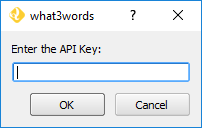

.. (c) 2016 Boundless, http://boundlessgeo.com
   This code is licensed under the GPL 2.0 license.

.. _configuration:

Configuration
=============

Set API key
-----------

To use |current_plugin|, you will need to have an API key, which can be signed up for `here <https://map.what3words.com/register?dev=true>`_.

Once you have an API key, it should be configured in the plugin using the :menuselection:`Plugins --> what3words --> Set API Key` menu item.

	
	Setting up the API key
	
If you don't configure the API key, you will be prompted to enter one when calling any of the tools the plugin provides.
