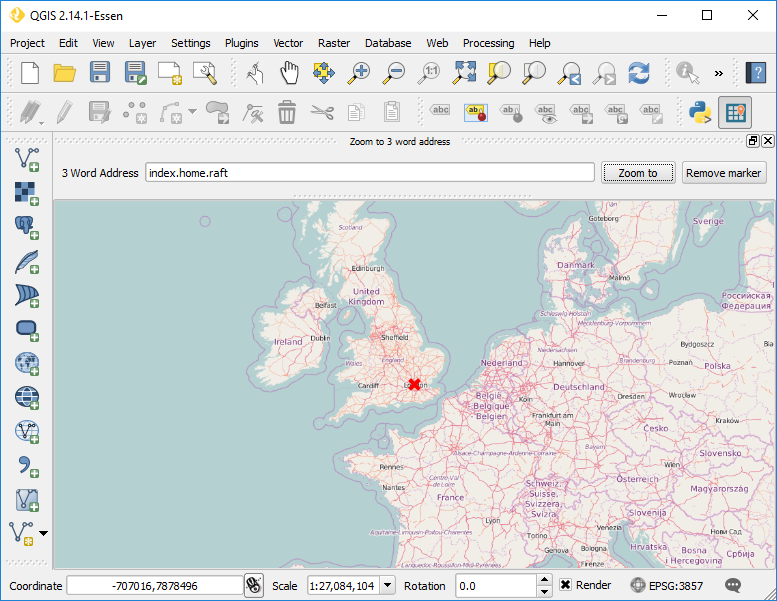
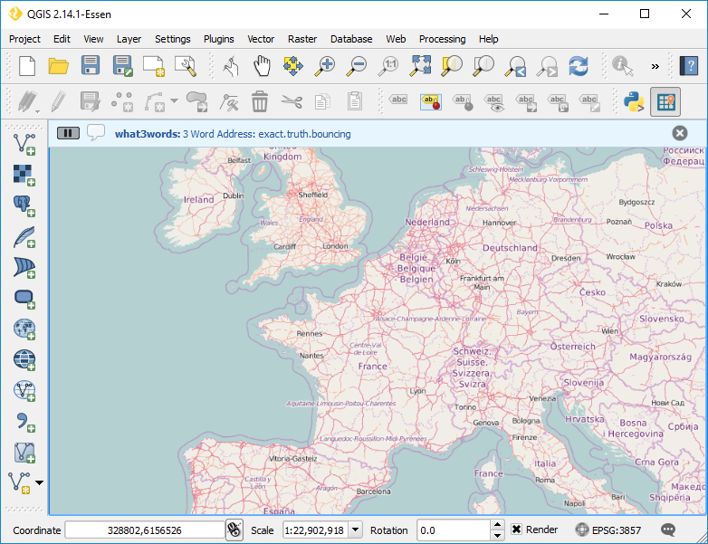
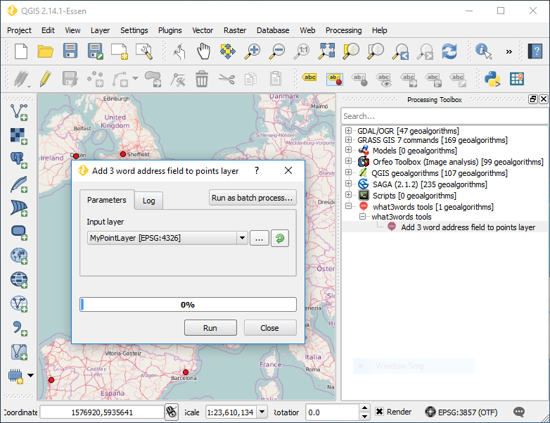

Usage
#####

The |current_plugin| contains 3 tools:

* :ref:`zoom-to-w3w`
* :ref:`w3w-map-tool`
* :ref:`w3w-processing`

.. note::

   If you didn't configure an API key (see :ref:`configuration`), you will be prompted to enter one when calling any of the tools the plugin provides.

.. _zoom-to-w3w:

Zoom to 3 Word Address Tool
===========================

The *Zoom to 3 word address* tool will allow you to zoom the map canvas to a given 3 word address. The tool is accessed trough the :guilabel:`Zoom to 3 word address` panel. If the panel is not active yet, go to :menuselection:`Plugins --> what3word` and click :guilabel:`Zoom to 3 word address` item.

Insert the desired 3 word address in the :guilabel:`3 Word Address` field. The address should be specified as *word.word.word*. If valid, the map canvas will zoom to the 3 word address, and a marker will be added to the corresponding position.

    
   Map canvas centered on the inserted 3 word address

.. _w3w-map-tool:

3 Word Address Map Tool
=======================

The *what3words map tool* is activated via the :menuselection:`Plugins > what3words > what3words map tool` menu item.
When activated, clicking anywhere on the QGIS map canvas with your mouse will display the 3 word address that corresponds to the mouse position in the QGIS message bar, as shown in the next figure. 

   
   What 3 words plugin map tool message

Along with that, for the users best convenience, the 3 word address is also copied to the system clipboard.

.. _w3w-processing:

Add 3 word Addresses Processing Algorithm
=========================================

The |current_plugin| adds a processing algorithm to QGIS that allows you to determine the three word address for all features in an **updatable** point layer and add them in a field called *3WordAddr*. The algorithm is available in the QGIS in the *Processing Toolbox* under *what3words tools > what3words tools > Add 3 word address field to points layer*. In the algorithm dialog, select a point layer as :guilabel:`Input layer` and press :guilabel:`Run` as shown below.

   
   Add 3 word address field to point layer algorithm dialog

If you then open the layer's attribute table, you will find a new **3WordAddr* field populated with the corresponding 3 word addresses. 

.. figure:: img/5-processing-result.png
   :align: center
   
   Attribute table with new 3WordAddr Field
