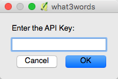

QGIS what3words Plugin
########################

Tools to use what3words 3 word addresses in QGIS

The plugin contains 3 tools:

- zoom to 3 word address tool
- 3 word address map tool
- add 3 word addresses processing algorithm

Plugin Configuration
=======================

To use what3words, you'll need an API key, which can be signed up for `here <https://map.what3words.com/register?dev=true>`_.
Once you have an API key, this should be configured in the plugin via the *Plugins > what3words > Set API Key* menu item.

If you haven't configured an API key, you will be prompted to enter one when calling any of the tools the plugin provides.

Zoom to 3 Word Address Tool
============================

The *Zoom to 3 word address* tool is activated via the *Plugins > what3words > Zoom to 3 word address* menu item and
allows you to enter a 3 word address, which
should be specified as *word.word.word*. If valid, the map will display and zoom to the 3 word address.

.. image:: 2-zoom-to.png
	:align: center

3 Word Address Map Tool
=======================

The *what3words map tool* is activated via the *Plugins > what3words > what3words map tool* menu item.
When activated, clicking anywhere on the QGIS map canvas with your mouse will display the
3 word address that corresponds to the mouse position in the QGIS message bar.

.. image:: 3-map-tool.png
	:align: center

Add 3 word Addresses Processing Algorithm
==========================================

The plugin adds an additional processing algorithm to QGIS which allows you
to determine the 3 word address for any points in an updatable layer and add them
as a new field called *3WordAddr*. The algorithm is available in the QGIS
*Processing Toolbox* under *what3words tools > what3words tools > Add 3 word address field to points layer*.

.. image:: 4-processing.png
	:align: center

