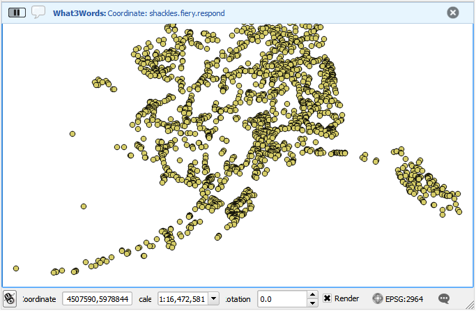
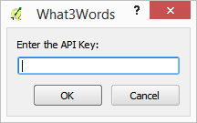

What3Words Tools
=====================

Tools to use What3Words coordinates in QGIS
-------------------------------------

The plugin contains 2 tools:

- Zoom to coordinate
- What3Words map tool

To use the map tool, select the *What3Words map tool* item in the What3Words tools menu. 

The map tool will get activated. When you now click with your mouse on the QGIS map canvas, the What3Words coordinates corresponding to the mouse position will be displayed in the QGIS message bar.

The *Zoom to coordinate* tool allows you to zoom to a given What3Words coordinate. Enter the coordinate as three words separated by dots.

.. image:: zoomto.png

To use the What3Words service, you need an API key. You can set the API key using the *Set API key menu*

If you haven't set up an API key, you will be prompted to enter one when calling any of the tools described above.
