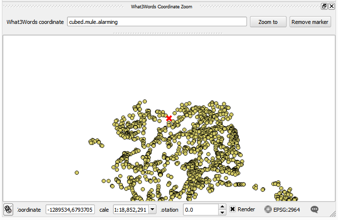

what3words Tools
=====================

Tools to use what3words 3 word addresses in QGIS
-------------------------------------

The plugin contains 2 tools:

- Zoom to 3 word address
- what3words map tool

To use the map tool, select the *what3words map tool* item in the what3words tools menu.

The map tool will get activated. When you now click with your mouse on the QGIS map canvas, the 3 word address corresponding to the mouse position will be displayed in the QGIS message bar.

.. image:: docs/imgs/messagebar.png

The *Zoom to 3 word address* tool allows you to zoom to a given 3 word address. Enter the 3 word address as three words separated by dots.

To use the what3words service, you need an API key. You can sign up for an API key at http://developer.what3words.com/ and set the API key using the *Set API key menu*

.. image:: docs/imgs/apikey.png

If you haven't set up an API key, you will be prompted to enter one when calling any of the tools described above.
